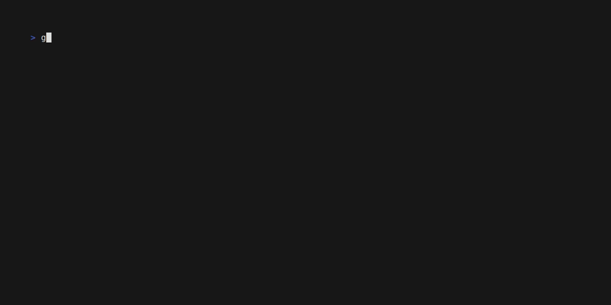

 


# GD Manager (gdm)

**GD Manager** (`gdm`) is a CLI tool for managing Godot plugin dependencies.

## Supported Godot versions

- 3.6.x
- 4.5.x

## Temporary directory

CLI creates a `.gdm` directory, where it will temporarily keep the downloaded compressed assets. You can add the `.gdm` directory to `.gitignore` to keep it away from the version control:

**Example `.gitignore` entry:**
```bash
.gdm
```

## Important: Managing Plugins with `gdm`

When using `gdm`, all plugin additions and removals should be performed through the CLI tool. Directly editing the `project.godot` file to add or remove plugins is not supported and may result in inconsistencies or overwritten changes.

`gdm` manages the `[editor_plugins]` section of your `project.godot` file automatically. Any manual changes to plugin entries in this file may be lost the next time you run a `gdm` command that modifies plugins. Always use `gdm add` or `gdm remove` to ensure your project stays in sync and your plugin configuration is preserved correctly.

> There is no way to migrate previously installed plugins to `gdm`. Suggested way is to reinstall all plugins via `gdm` to keep `gdm.json` and `project.godot` in sync.

## Features

- Add plugins to your project
- Install all listed plugins
- Update plugins to their latest versions
- Check for outdated plugins
- Search for plugins
- Remove plugins

## Installation

Download the latest release for your platform from the [GitHub Releases page](https://github.com/k0psutin/gdm/releases).

1. Go to the [releases page](https://github.com/k0psutin/gdm/releases).
2. Download the appropriate binary for your operating system.
3. Extract the downloaded archive.

### Installation Methods

You can install `gdm` either globally (available system-wide) or locally (just for your project).

#### Install Globally

This makes `gdm` available from any terminal window.

##### Linux

```bash
tar -xzf gdm-linux-x86_64.tar.gz
sudo mv gdm /usr/local/bin/
```

##### Windows

Extract the `gdm-windows.zip` file and move `gdm.exe` to a folder in your `PATH` (e.g., `C:\gdm`), or add the extracted folder to your `PATH`.

##### macOS

```bash
tar -xzf gdm-macos-aarch64.tar.gz
sudo mv gdm /usr/local/bin/
```

#### Install Locally (Project Folder)

You can place the `gdm` binary directly inside your Godot project directory and run it from there without installing globally. This is useful if you want to keep the tool project-specific or don't have permission to install system-wide.


## Usage

Run `gdm <command> [options]` in your Godot project directory.



### Commands

#### `add`

Add a plugin dependency to your project.

```bash
gdm add '<asset-name>'
```


You can optionally specify the `--asset-id` and `--version` flags:

```bash
gdm add '<asset-name>' [--asset-id <godot-asset-id>] [--version <version>]
```

- `--asset-id`: Specify the Godot Asset ID for the plugin.
- `--version`: Specify the version of the plugin to add.

> **Note:** If you add a plugin that is already present, `gdm` will attempt to update it to the specified (or latest) version. To install a specific older version, use the `--version` flag with the desired version number.

#### `install`

Install all plugin dependencies listed in your project.

```bash
gdm install
```


#### `update`

Update all plugins to their latest versions.

```bash
gdm update
```


#### `outdated`

List plugins that have newer versions available.

```bash
gdm outdated
```


#### `search`

Search for plugins by plugin title.

```bash
gdm search '<asset-name>'
```


You can optionally specify the `--godot-version` flag to filter results by Godot version:

```bash
gdm search '<asset-name>' --godot-version '<version>'
```

- `--godot-version`: Only show plugins compatible with the specified Godot version.

By default, the CLI tries to determine the Godot version used in your project from the `project.godot` file. If it cannot detect the version automatically, or if you want to search or install plugins for a different or older Godot project, you should use the `--godot-version` flag to specify the desired version explicitly.

#### `remove`

Remove a plugin dependency from your project.

> **Note:** The `<plugin-name>` must match the name of the plugin as it appears in your `gdm.json` file.

```bash
gdm remove '<plugin-name>'
```


## License

MIT
