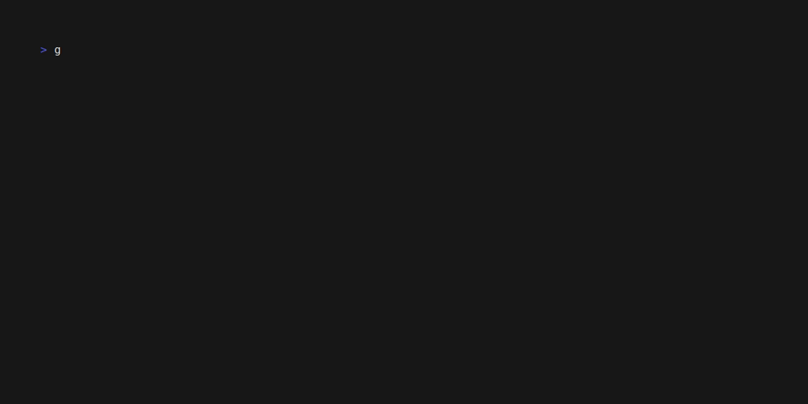

# GD Manager (gdm)

**GD Manager** (`gdm`) is a CLI tool for managing Godot plugin dependencies, similar to npm or cargo for Godot projects.

## Table of Contents

- [Quick Start](#quick-start)
- [Features](#features)
- [Supported Godot Versions](#supported-godot-versions)
- [Installation](#installation)
- [Usage](#usage)
  - [add](#add)
  - [install](#install)
  - [update](#update)
  - [outdated](#outdated)
  - [search](#search)
  - [remove](#remove)
- [Examples](#examples)
- [Bug Reports and Issues](#bug-reports-and-issues)
- [License](#license)

## Quick Start

1. Download `gdm` for your platform from the [releases page](https://github.com/k0psutin/gdm/releases)
2. Place the binary in your PATH or project directory
3. Navigate to your Godot project directory
4. Search for a plugin: `gdm search "dialogue"`
5. Add the plugin: `gdm add "Dialogue Manager"`
6. Install: `gdm install`

That's it! Your plugin is now installed and ready to use.

## Features

- Search for plugins from the Godot Asset Library
- Add plugins from Asset Library or Git repositories
- Install all project dependencies with one command
- Update plugins to their latest versions
- Check for outdated plugins
- Remove plugins cleanly
- Automatic `project.godot` management
- Dependency tracking via `gdm.json`
- Support for Git-based plugins

## Supported Godot Versions

- 3.6.x
- 4.5.x

## Temporary Directory

`gdm` creates a `.gdm` directory to temporarily store downloaded compressed assets. Add this to your `.gitignore`:

**Example `.gitignore` entry:**
```bash
.gdm
```

## Important: Managing Plugins with `gdm`

When using `gdm`, **all plugin additions and removals should be performed through the CLI**. Manual editing of `project.godot` is not supported and may cause inconsistencies.

### How It Works

- `gdm` automatically manages the `[editor_plugins]` section in `project.godot`
- Plugin metadata is stored in `gdm.json` for dependency tracking
- Manual changes to plugin entries may be overwritten by `gdm` commands

### Migration from Manual Plugin Management

> **Important:** There is no automatic migration path for existing plugins. To use `gdm` with a project that already has plugins:
> 
> 1. Note your current plugins
> 2. Remove them manually from `project.godot` and `/addons`
> 3. Reinstall via `gdm add` and `gdm install`
> 
> This ensures `gdm.json` and `project.godot` stay synchronized.

### Plugins with Multiple Assets

If a downloaded asset contains multiple folders in `/addons`, `gdm` automatically identifies the main plugin for `gdm.json`. Additional assets are marked as `sub_assets`.

## Installation

Download the latest release for your platform from the [GitHub Releases page](https://github.com/k0psutin/gdm/releases).

### Installation Methods

Choose between global installation (accessible from anywhere) or local installation (project-specific).

#### Global Installation (Recommended)

Makes `gdm` available system-wide from any terminal.

**Linux:**

```bash
tar -xzf gdm-linux-x86_64.tar.gz
sudo mv gdm /usr/local/bin/
```

**macOS:**

```bash
tar -xzf gdm-macos-aarch64.tar.gz
sudo mv gdm /usr/local/bin/
```

**Windows:**

1. Extract `gdm-windows.zip`
2. Move `gdm.exe` to a folder in your `PATH` (e.g., `C:\Program Files\gdm`)
3. Or add the extracted folder to your system `PATH`

#### Local Installation (Project-Specific)

Place the `gdm` binary in your Godot project directory. Useful for:
- Project-specific tooling without system-wide installation
- Environments where you don't have admin/sudo privileges
- Keeping different `gdm` versions per project

## Usage

Run `gdm <command> [options]` in your Godot project directory.


### Commands

#### `add`

Add a plugin dependency to your project from the Godot Asset Library.

**Basic usage:**

```bash
gdm add '<asset-name>'
```


**With optional flags:**

```bash
gdm add '<asset-name>' [--asset-id <godot-asset-id>] [--version <version>]
```

**Flags:**
- `--asset-id`: Specify the Godot Asset Library ID (useful when asset name is ambiguous)
- `--version`: Install a specific version instead of the latest

**Adding from Git repositories:**

```bash
gdm add --git <git-url> --ref <branch-or-tag-or-commit>
```

**Flags:**
- `--git`: Git repository URL (HTTPS or SSH)
- `--ref`: Branch name (e.g., `main`), tag (e.g., `v1.2.3`), or commit hash (e.g., `abc123`)



**Examples:**
```bash
# Add from Asset Library
gdm add "Dialogue Manager"
gdm add "Dialogue Manager" --version "3.1.0"

# Add from Git using branch
gdm add --git https://github.com/username/godot-plugin.git --ref main

# Add from Git using tag  
gdm add --git https://github.com/username/godot-plugin.git --ref v1.2.3

# Add from Git using commit hash
gdm add --git https://github.com/username/godot-plugin.git --ref a1b2c3d
```

> **Note:** When adding a plugin that already exists, `gdm` will update it to the specified version. Git plugins are **not** auto-updated by `gdm update` - you must manually remove and re-add them with a new `--ref` to update.

#### `install`

Install all plugin dependencies listed in `gdm.json`.

```bash
gdm install
```


#### `update`

Update all Asset Library plugins to their latest versions.

```bash
gdm update
```


> **Note:** Plugins installed via Git (`--git` flag) will not be updated by this command.

#### `outdated`

Check which Asset Library plugins have newer versions available.

```bash
gdm outdated
```


> **Note:** Plugins installed via Git (`--git` flag) will not be shown by this command.

#### `search`

Search the Godot Asset Library for plugins.

```bash
gdm search '<asset-name>'
```


**With Godot version filter:**

```bash
gdm search '<asset-name>' --godot-version '<version>'
```

**Example:**
```bash
gdm search "dialogue" --godot-version "4.3"
```

#### `remove`

Remove a plugin from your project.

```bash
gdm remove '<plugin-name>'
```


> **Note:** The `<plugin-name>` must match the plugin name as it appears in your `gdm.json` file.

## Examples

### Setting Up a New Project

```bash
# Initialize your Godot project first in Godot Editor
cd my-godot-project

# Search for plugins
gdm search "dialogue manager"

# Add plugins
gdm add "Dialogue Manager 3"
gdm add "Godot Unit Testing"
```

### Cloning an Existing Project

```bash
# Clone the project
git clone https://github.com/username/godot-game.git
cd godot-game

# Install all dependencies
gdm install
```

### Updating Dependencies

```bash
# Check for updates
gdm outdated

# Update all plugins
gdm update
```

## Bug Reports and Issues

Found a bug or have a feature request? Please [create an issue](https://github.com/k0psutin/gdm/issues) on GitHub.

**When reporting bugs, please include:**
- Your operating system (Linux, macOS, Windows)
- Your Godot version
- `gdm` version (shown with `gdm --version`)
- Steps to reproduce the issue
- Error messages or logs
- Your `gdm.json` file (if relevant)

**For feature requests:**
- Describe the feature and why it would be useful
- Provide examples of how it would work

## License

MIT
